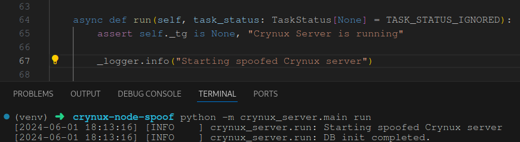
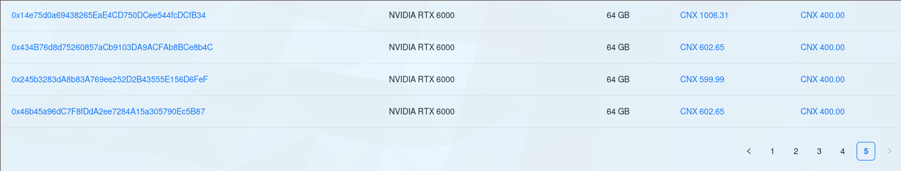

Let's try running our own Crynux node.

Right now, it seems the network has been deployed on the Blumbus Testnet for Dymension. All the deployed smart contracts source code can be found [here](https://github.com/crynux-ai/crynux-contracts/tree/main/contracts) and the contract addresses have been baked into the config file for the node.

We're building it from source rather than using a precompiled binary as we want to tinker with it later...

## Observations

- You download around 67 GB of models off the bat
	- The models include:
		- Stable Diffusion v1.5
		- Some Stable Diffusion distribution that seems [optimized for generating images of Asian women](https://huggingface.co/emilianJR/chilloutmix_NiPrunedFp32Fix). No comment.
		- Stable Diffusion XL
		- GPT2
		- Falcon-7B-Instruct
		- Controlnet Stable Diffusion (for pose based generation)
- You'll notice SD tasks coming in every few minutes. This is because this one task:
  
```task_args: {"base_model": "emilianJR/chilloutmix_NiPrunedFp32Fix", "prompt": "best quality, ultra high res, photorealistic++++, 1girl, off-shoulder sweater, smiling, faded ash gray messy bun hair+, border light, depth of field, looking at viewer, closeup", "negative_prompt": "paintings, sketches, worst quality+++++, low quality+++++, normal quality+++++, lowres, normal quality, monochrome++, grayscale++, skin spots, acnes, skin blemishes, age spot, glans", "task_config": {"num_images": 1, "safety_checker": false, "seed": 982883}}```

keeps getting requested. In fact, the vast majority of the CNX I've earned by running the node has been from this one dummy task that keeps coming in.

- Looks like after I started a spoofed node I started receiving LLM tasks with the prompt `What is LLM(large language model)? How can I use it?`. Cool.
- Timeout errors do occur (not from my end, that is), although not too frequently.

## Spoofing

Spoofing is trivial as the Crynux node is primarily composed of the `crynux_server` and `crynux_worker` modules that you build yourself. Given that these are python modules, you just need to edit the module files and you're on your way.



I can spoof my GPU details quite trivially, actually, and this even shows up on the stats page:


